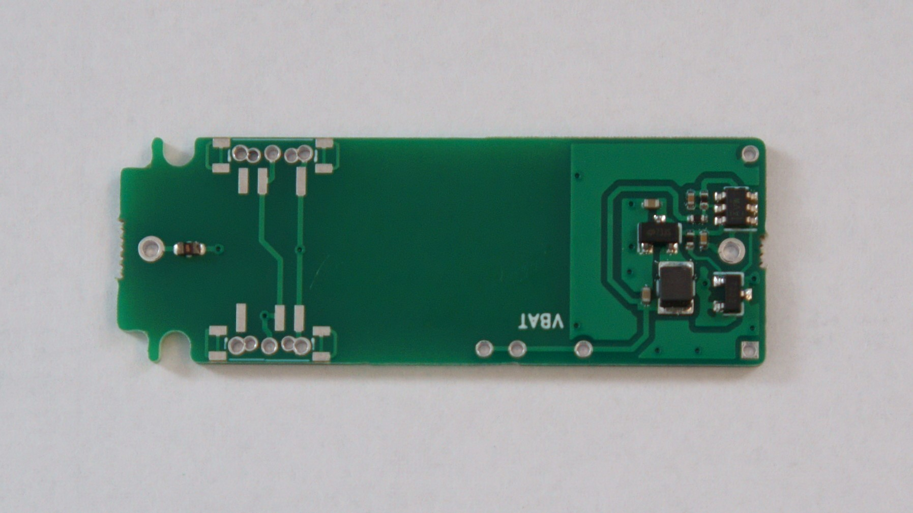
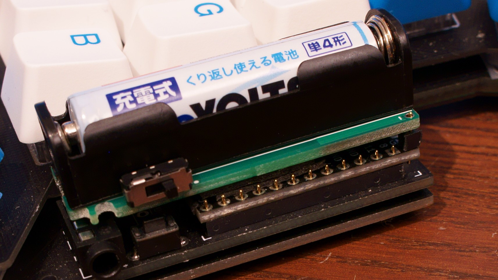
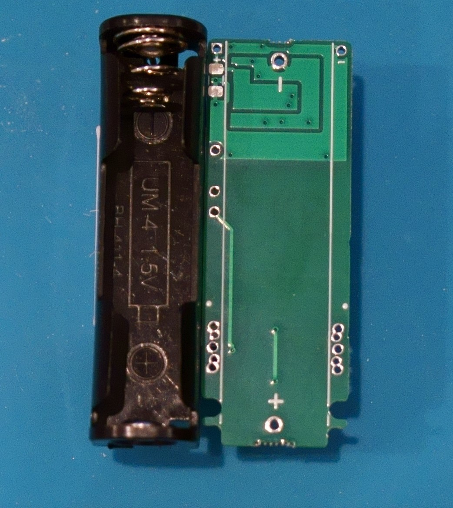
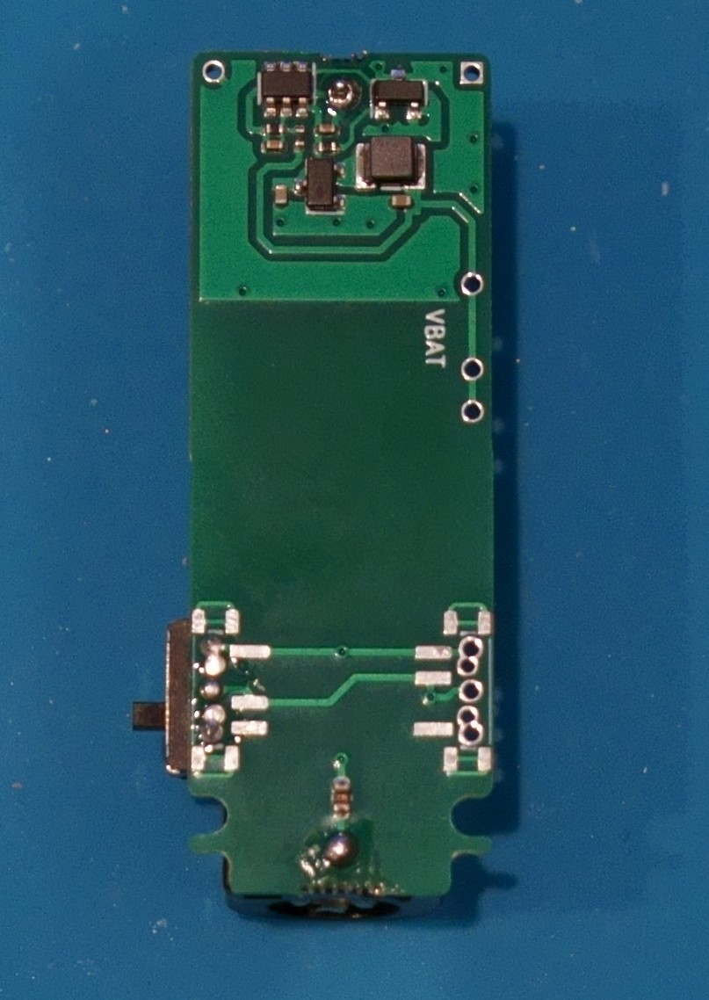

# 単4電池昇圧モジュール
単4電池を昇圧して3.3Vを出力するモジュールです
主にBLE Micro Proと組み合わせて使用することを想定しています 

過放電防止の為、電池の電圧が1Vを下回ると出力を停止します
電池を使い切ったら速やかに取り出してください

|基板本体|取り付け例|
|-|-|
|| |

**仕様等は予告なく変更となる場合があります**

## 使用上のご注意
- 異臭や煙が出たときは、ただちに使用を中止して電源を切り電池を
　抜いてください
- 電池から漏れた液が目に入った場合は、失明する恐れがあるのですぐにきれいな水でよく洗い、医師の診断を受けてください
- 電池の+-を正しくセットしてください
- 使い切った電池は速やかに取り出してください
- 長期間使用しない場合は電池を取り出してください

## ビルドガイド
- 電池ボックスとスライドスイッチをハンダ付けしてください
  - 電池ボックスに電池をいれたままハンダ付けは**絶対にしないでください**
  - スライドスイッチは左右のどちらかに取り付けてください
  - スライドスイッチの左右の穴は2個つながっているのでハンダが流れ込んでしまっても構いません

## 取り付け
- 裏向きにしたBLE Micro Proにそのままの乗せると+-の極性が一致します
  - 作例ではコンスルーを1ピンだけ切り出したものと、厚手の両面テープを何枚か重ねたもので固定、接続しています
- 必要に応じて、ショートしないように裏側にビニールテープなどを貼り付けてください
- スライドスイッチを電池の-極側にスライドさせると電源ONが入ります